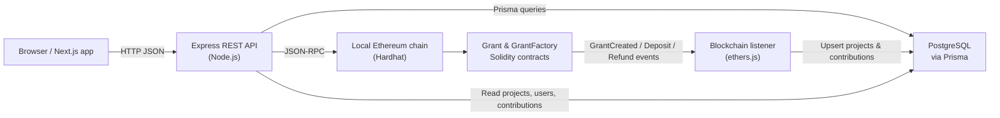

# Greenlight

Greenlight is a Web3 crowdfunding app with on-chain escrow and refunds for backers.

Originally built as a personal portfolio project, this repository is now documented as a public demo application and should not be used for real fundraising or real funds.

Backers fund projects in ETH. Funds stay locked in a smart contract until the goal is reached. If a campaign misses its goal, contributors can claim refunds.

## Features

- Create grant-style fundraising projects with goals and deadlines.
- Lock contributions in smart contracts until goals are reached or deadlines pass.
- Support refunds to backers when a project misses its goal.
- Track total amount raised and contribution history per project and per wallet.
- Browse featured projects, project details, and recent activity in a modern Next.js UI.

## System design



The backend starts the blockchain listener automatically when `NEXT_PUBLIC_CHAIN_RPC` and `NEXT_PUBLIC_FACTORY_ADDRESS` are configured, keeping the database in sync with on-chain events.

## Tech stack

- Frontend: Next.js App Router, TypeScript, Chakra UI, React Query, wagmi, viem
- Auth / wallet: Privy + wagmi integration for connecting EVM-compatible wallets
- Backend: Node.js, Express, Prisma, PostgreSQL
- Blockchain: Solidity, Hardhat, ethers.js, OpenZeppelin
- Tooling: TypeScript across all packages, npm workspaces monorepo

## Repository layout

```text
greenlight/
├── contracts/   Solidity escrow contracts, Hardhat config, tests
├── backend/     Express REST API, Prisma schema, blockchain listener
└── frontend/    Next.js UI, wallet integration, mock/live data modes
```

## Running the project

### Prerequisites

- Node.js 20+
- PostgreSQL 14+ for live mode

### Install dependencies

```bash
npm install
```

### Environment configuration

Create a `.env` file at the repo root (you can start from `.env.example`):

```bash
cp .env.example .env
```

Important variables:

```env
# Database
DATABASE_URL=postgresql://<pg_user>@localhost:5432/greenlight?schema=public

# Backend HTTP port
PORT=4000

# REST API base URL used by the frontend
NEXT_PUBLIC_API_URL=http://localhost:4000

# Local blockchain
NEXT_PUBLIC_CHAIN_RPC=http://127.0.0.1:8545
NEXT_PUBLIC_FACTORY_ADDRESS=0x...

# Auth / wallet
NEXT_PUBLIC_PRIVY_APP_ID=
PRIVY_APP_SECRET=

# Frontend data mode (optional)
# If omitted or set to "true", the frontend uses static mock data.
# Set to "false" to talk to the live backend.
NEXT_PUBLIC_USE_MOCK_DATA=true
```

### Demo mode (mock data, no backend required)

In demo mode the frontend uses static mock projects and does not require a running blockchain, database, or backend.

```bash
npm --workspace frontend run dev
```

Ensure `NEXT_PUBLIC_USE_MOCK_DATA` is omitted or set to `true` in `.env`.

### Full stack mode (local chain + backend + frontend)

This runs the Hardhat node, deploys contracts, prepares the database, starts the API, and starts the frontend.

```bash
# 1. Start local chain
npm run dev:chain

# 2. Deploy contracts to the local chain
npm run deploy

# 3. Prepare database schema and seed data
npm run db:setup

# 4. Start backend + frontend in parallel
npm run dev
```

## Key scripts (monorepo root)

- `npm run dev` – start backend and frontend together
- `npm run dev:frontend` – start only the Next.js frontend
- `npm run dev:backend` – start only the Express API
- `npm run dev:chain` – start the Hardhat local chain
- `npm run deploy` – deploy contracts to the local chain
- `npm run db:push` – push Prisma schema to the database
- `npm run db:reset` – reset the database (destructive)
- `npm run db:setup` – push schema and seed initial data
- `npm run seed` – run the backend seed script
- `npm run test:contracts` – run Solidity unit tests via Hardhat

## REST API

The REST API is served by the backend on `http://localhost:4000` by default (configurable via `PORT`). The frontend uses `NEXT_PUBLIC_API_URL` to talk to it.

### Health

- `GET /health` – simple health check that returns `{ status: "ok", timestamp: ... }`.

### Users

- `GET /users/:walletAddress`
	- Look up a user by EVM wallet address (case-insensitive).
	- Response includes:
		- `projects`: projects created by this wallet.
		- `contributions`: contribution records with basic project info.

### Projects

- `POST /projects`
	- Create or update a project corresponding to a deployed `Grant` contract.
	- Body (JSON):
		- `grantContractAddress` (string, required) – address of the `Grant` contract.
		- `title` (string, required)
		- `description` (string, optional)
		- `imageUrl` (string, optional)
		- `goalAmount` (string | number, required) – goal in wei.
		- `deadline` (string, required) – ISO timestamp.
		- `creatorWallet` (string, required) – creator wallet address.
	- Behavior:
		- Validates EVM address format for `grantContractAddress` and `creatorWallet`.
		- Upserts the `user` row for the creator.
		- Upserts the `project` row keyed by `grantContractAddress`.
		- Returns the created/updated project.

- `GET /projects`
	- List projects with cursor-based pagination.
	- Query params:
		- `cursor` (string, optional) – project ID to start after.
		- `limit` (number, optional, default 20, max 100).
	- Response:
		- `{ data: Project[], nextCursor: string | null }`, where each project includes `_count.contributions`.

- `GET /projects/:id`
	- Fetch a single project by ID.
	- Includes:
		- `contributions` ordered newest-first.
		- `_count.contributions` for quick stats.

### Contributions

- `POST /contributions`
	- Record a contribution for a project. This is called both from the frontend and from the blockchain listener.
	- Body (JSON):
		- `projectId` (string, required) – foreign key to the project.
		- `walletAddress` (string, required) – contributor wallet.
		- `amount` (string | number, required) – contribution amount in wei.
		- `txHash` (string, required) – transaction hash.
	- Behavior:
		- Validates address and tx hash formats.
		- Idempotent: if a contribution with the same `txHash` already exists, returns it without creating a duplicate.
		- Upserts the `user` row for the contributor.
		- Recomputes `project.amountRaised` from all non-refunded contributions.

- `GET /contributions`
	- List contributions, optionally filtered by project.
	- Query params:
		- `projectId` (string, optional).
	- Response: array of contribution records ordered newest-first.

## Smart contracts

Contracts live in `contracts/` and are written in Solidity 0.8.24.

- `GrantFactory.sol`
	- Deploys new `Grant` escrow contracts via `createGrant(goalAmount, deadline)`.
	- Emits `GrantCreated` with a sequential `grantId` and the deployed contract address.
	- Exposes `getGrants()` to enumerate deployed grant addresses.

- `Grant.sol`
	- Escrow contract for a single crowdfunding campaign.
	- Constructor sets the `creator`, `goalAmount`, and `fundingDeadline`.
	- `deposit()` – accept ETH from backers while the campaign is active, tracking contributions and total deposited; sets `goalReached` when the goal is met.
	- `withdraw()` – allow the creator to withdraw funds once `goalReached` is true.
	- `refund()` – allow backers to claim refunds after the deadline if the goal was not reached.
	- Uses OpenZeppelin `ReentrancyGuard` and custom errors for safety and clear failure modes.

## Frontend

The frontend (in `frontend/`) is a Next.js App Router app with Chakra UI.

- Home page: lists projects with pagination and shows current amount raised vs goal.
- Project detail: shows project metadata, contributions, and status.
- Create project: form to deploy a new `Grant` via the factory contract and register it with the backend.
- Activity feed: shows recent contributions across projects.
- Wallet & auth: integrates Privy and wagmi for connecting an EVM-compatible wallet and associating it with a user record.

The frontend can run purely against static mock data or against the live API and contracts, depending on `NEXT_PUBLIC_USE_MOCK_DATA` and the configured API/chain endpoints.
